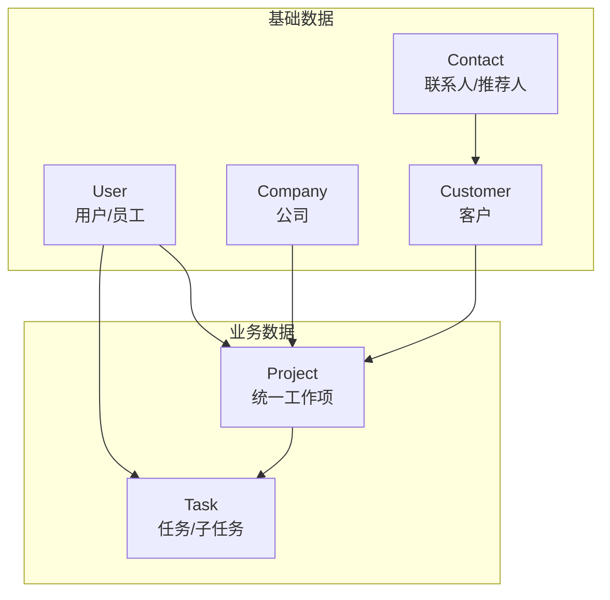
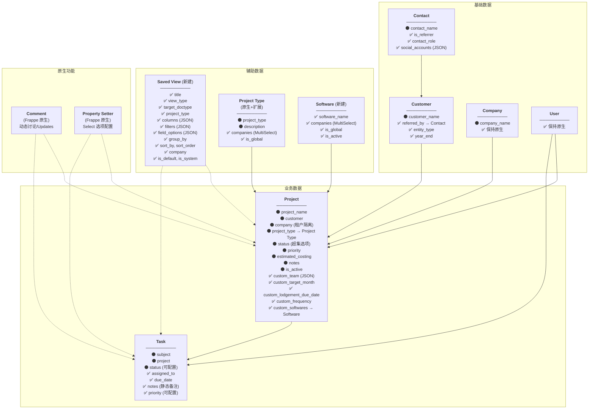

# 📄 Document A: Data Model - Refactoring Plan
# 数据模型 - 重构规划文档

**项目**: Smart Accounting  
**版本**: v6.0  
**日期**: 2025-12-16  
**状态**: 🔄 重构规划中 (Prototype 阶段)  
**重构策略**: ✅ **最大化利用 ERPNext 原生 DocType**  
**SaaS架构**: ✅ **Frappe原生多Site架构**（每租户独立Site，天然隔离）

---

## 更新日志 (v6.0 - 2025-12-16)

### 架构优化
- ✅ **Software字段**：新建独立DocType（支持租户自定义，多Site架构天然隔离）
- ✅ **Project Type**：使用ERPNext原生DocType + 扩展companies字段（支持单Site多Company场景）
- ✅ **Status**：使用原生字段 + Property Setter配置（多Site架构下每租户独立配置）
- ✅ **SaaS架构**：确认采用Frappe原生多Site架构（每租户独立Site，天然数据隔离）
- ❌ **Fiscal Year**：从Project中删除（财年信息可包含在project_name中，如"FY24 ITR"）

---

## 目录

1. [重构决策（已确认）](#1-重构决策已确认)
2. [新架构概览](#2-新架构概览)
3. [核心 DocType 字段设计](#3-核心-doctype-字段设计)
4. [辅助 DocType](#4-辅助-doctype)
5. [删除的 DocType](#5-删除的-doctype)
6. [使用场景](#6-使用场景)
7. [实施步骤](#7-实施步骤)
8. [待确认问题](#8-待确认问题)

---

## 1. 重构决策（已确认）

### 1.1 重构策略

| 决策项 | 结果 | 日期 |
|--------|------|------|
| **核心原则** | ✅ 最大化利用 ERPNext 原生 DocType | 2025-12-10 |
| **Project** | ✅ 使用 ERPNext 原生 Project + 扩展字段（统一承载所有业务类型）| 2025-12-10 |
| **Task** | ✅ 使用 ERPNext 原生 Task + 扩展字段 | 2025-12-10 |
| **Engagement** | ❌ **不再新建**，用 Project 替代 | 2025-12-10 |
| **Saved View** | ✅ 新建 DocType，替代 Partition | 2025-12-10 |

### 1.2 为什么只用 Project？

| 考量 | 说明 |
|------|------|
| **简化架构** | 一个 DocType 统一承载会计业务和项目业务 |
| **减少开发量** | Project 是 ERPNext 原生，只需扩展字段 |
| **SaaS 友好** | 不同客户（会计所/项目公司）用同一个 Project，通过 `project_type` 区分 |
| **维护简单** | 一套代码，更容易维护 |

### 1.3 架构处理方式

| 层级 | 处理方式 |
|------|---------|
| **ERPNext 原生扩展** | Customer / Contact / User / Company / Project / Task 保持原生，添加扩展字段 |
| **新建 DocType** | Software（软件列表）、Saved View（视图配置）|
| **Project Type** | 使用ERPNext原生Project Type + 扩展companies字段 |
| **Property Setter** | Status 等Select字段选项配置（多Site架构下每租户独立配置）|
| **原生功能利用** | Comment 系统（审核备注）、User Settings（用户偏好）|
| **现有数据** | 编写迁移脚本从旧 Task 结构转移到 Project |

---

## 2. 新架构概览

### 2.1 核心设计理念

```
统一工作项 + 用户自定义视图：

- Project    → 统一承载所有业务（会计业务 / Grants项目 / 其他）
- Task       → 子任务 或 独立任务
- Saved View → 替代 Partition，用户自定义显示字段

通过 project_type 区分业务类型：
- "ITR" / "BAS" / "Bookkeeping" → 会计业务
- "R&D Grant" / "Export Grant" → Grants 项目
- 其他自定义类型...
```

### 2.2 新架构关系图 (Mermaid)

**图 1：核心架构概览**



---

**图 2：完整 DocType 架构（开发参考）**

> **图例**：⚫ 原生字段 | ✅ 已确认扩展 | 🔧 可配置（Property Setter）



### 2.3 统一 Workflow 链

```
┌─────────────────────────────────────────────────────────────────┐
│                    统一业务链（Project 承载所有业务）              │
├─────────────────────────────────────────────────────────────────┤
│                                                                  │
│   Company ──┐                                                    │
│             ├──► Project ──► Task                               │
│   Customer ─┘      │                                            │
│                    │                                            │
│                    ├── project_type = "ITR" (会计业务)          │
│                    ├── project_type = "BAS" (会计业务)          │
│                    ├── project_type = "Bookkeeping" (会计业务)  │
│                    ├── project_type = "R&D Grant" (Grants)      │
│                    └── project_type = "..." (其他)              │
│                                                                  │
│   示例 1: TF + Client A → FY24 ITR (type=ITR) → Collect Docs   │
│   示例 2: TG + Client B → R&D Grant 2024 (type=R&D) → Submit   │
│                                                                  │
└─────────────────────────────────────────────────────────────────┘
```

### 2.4 开发顺序

> **从干净原生 ERPNext 开始，逐步扩展：**

```
Step 1: 基础层扩展
        ├── Customer 扩展（referred_by, entity_type, year_end）
        └── Contact 扩展（is_referrer, contact_role）

Step 2: 核心层扩展
        ├── Project 扩展（6 个扩展字段：team, team_members, target_month, lodgement_due_date, frequency, softwares + 配置原生project_type字段）
        └── Task 扩展（4 个扩展字段：assigned_to, due_date, notes, priority）

Step 3: 视图层
        └── 创建 Saved View DocType（13 个字段）

Step 4: 数据迁移
        └── 旧 Task 数据 → Project
```

---

## 3. 核心 DocType 字段设计

### 3.1 Project（统一工作项）

> **定位**：使用 ERPNext 原生 Project，添加扩展字段，统一承载所有业务类型（会计业务 + Grants 项目 + 其他）

| 字段 | 字段名 | 类型 | 必填 | 来源 | 说明 |
|------|--------|------|------|------|------|
| **原生字段（直接使用）** ||||||
| 项目名称 | `project_name` | Data | ✅ | ERPNext 原生 | 如 "Client A - FY24 ITR" |
| 客户 | `customer` | Link → Customer | ✅ | ERPNext 原生 | 所属客户 |
| 公司 | `company` | Link → Company | ✅ | ERPNext 原生 | 所属公司（**SaaS 租户隔离关键**）|
| 状态 | `status` | Select | ✅ | ERPNext 原生 | 工作状态（可通过 Property Setter 配置选项）|
| 优先级 | `priority` | Select | | ERPNext 原生 | Low/Medium/High |
| 预计开始 | `expected_start_date` | Date | | ERPNext 原生 | 开始日期 |
| 预计结束 | `expected_end_date` | Date | | ERPNext 原生 | 内部目标截止日期 |
| 预算 | `estimated_costing` | Currency | | ERPNext 原生 | 预算金额 |
| 备注 | `notes` | Text Editor | | ERPNext 原生 | 静态备注（对标 Monday Notes）|
| 是否活跃 | `is_active` | Select | | ERPNext 原生 | Yes=未归档 / No=已归档 |
| 项目类型 | `project_type` | Link → Project Type | | ERPNext 原生 | 业务类型（ITR/BAS/Payroll...），扩展Project Type添加companies字段支持租户隔离 |
| **扩展字段 - 团队** ||||||
| 团队 | `custom_team` | JSON | | 扩展 | 存储角色人员 `{preparers:[], reviewers:[], partners:[]}` |
| 团队成员 | `custom_team_members` | Data | | 扩展 | 辅助筛选字段（逗号分隔，自动生成）|
| **扩展字段 - 业务** ||||||
| 目标月份 | `custom_target_month` | Select | | 扩展 | January~December |
| 法定截止日期 | `custom_lodgement_due_date` | Date | | 扩展 | ATO 规定的法定截止日期 |
| 频率 | `custom_frequency` | Select | | 扩展 | Annually/Quarterly/Monthly/...（按需显示）|
| 使用软件 | `custom_softwares` | Table MultiSelect | | 扩展 | Xero/MYOB/QuickBooks/Excel/... |

**团队 JSON 格式**：
```json
{
  "preparers": ["bob@tf.com", "david@tf.com"],
  "reviewers": ["charlie@tf.com"],
  "partners": ["alice@tf.com"]
}
```

> **为什么用 JSON？** Monday.com 风格的多人分配 UI 需要：
> - 列表加载快（无需 JOIN 子表）
> - 前端直接解析显示多人头像
> - 点击即弹出选择器，可多选

**Notes vs Comments（已确认）**：
```
┌─────────────────────────────────────────────────────────────────────────────┐
│ 功能        │ 对应 Monday.com │ 实现方式              │ 用途                │
├─────────────┼────────────────┼──────────────────────┼────────────────────┤
│ notes 字段  │ Notes 列        │ Text 字段（扩展）      │ 静态备注，表格直接显示 │
│ Comment     │ Updates 面板    │ Frappe 原生 Comment  │ 动态讨论，可 @mention │
└─────────────────────────────────────────────────────────────────────────────┘

示例：
- notes: "no need to lodge for FY25" / "Client will do by themselves"
- Comment: "@Jean Please review the updated BAS with client's response to QS."
```

**project_type 选项（按业务分类）**：
```
会计业务: ITR / BAS / Bookkeeping / Financial Statements / ...
Grants:   R&D Grant / Export Grant / ...
其他:     Ad-Hoc / Consulting / ...
```

**状态选项（可配置）**：
```
默认值: Not Started → Working → Ready for Review → Under Review → Completed

配置方式: Property Setter（Frappe 原生机制）
- 前端提供 "Edit Options" 按钮
- 用户可自定义状态标签和颜色
- SaaS 多租户时，每个 Site 独立配置
```

---

### 3.2 Task（任务/子任务）

> **定位**：可作为 Project 的子任务，也可独立使用

| 字段 | 字段名 | 类型 | 必填 | 说明 |
|------|--------|------|------|------|
| **原生字段** |||||
| 任务名称 | `subject` | Data | ✅ | ERPNext 原生 |
| 状态 | `status` | Select | ✅ | ERPNext 原生，选项可通过 Property Setter 自定义 |
| 所属项目 | `project` | Link → Project | | ERPNext 原生 |
| 父任务 | `parent_task` | Link → Task | | ERPNext 原生 |
| **扩展字段（已确认）** |||||
| 负责人 | `assigned_to` | Link → User | | ✅ 任务负责人（Owner）|
| 截止日期 | `due_date` | Date | | ✅ 任务截止日期 |
| 备注 | `notes` | Text | | ✅ 静态备注（对标 Monday Notes）|
| **扩展字段（其他）** |||||
| 客户 | `customer` | Link → Customer | | 独立任务时填写 |
| 完成日期 | `completed_date` | Date | | 实际完成日期 |
| 优先级 | `priority` | Select | | Low/Medium/High（可配置）|
| 排序 | `sequence` | Int | | 在父级下的排序 |

> **审核备注**：使用 Frappe 原生 Comment 系统，无需单独字段

**Task 状态选项（可配置）**：
```
默认值: Open → Working → Completed

配置方式: Property Setter（与 Project 相同）
```

**字段继承逻辑**：
```
如果 Task 有父级 Project:
  - customer/company 从 Project 继承（无需填写）
  - assigned_to 可以覆盖 Project 的 preparer

如果 Task 独立使用:
  - customer 自己填写
```

---

### 3.3 Saved View（视图配置）

> **状态**：✅ **基础字段已确认**（13 个通用字段）

> **定位**：替代 Partition，用户自定义显示哪些字段，实现多 Board 功能

| 字段 | 字段名 | 类型 | 必填 | 说明 |
|------|--------|------|------|------|
| **基础信息** |||||
| 视图名称 | `title` | Data | ✅ | 如 "Payroll", "ITR Board" |
| 视图类型 | `view_type` | Select | ✅ | system / tenant / personal |
| 目标 DocType | `target_doctype` | Select | ✅ | Project / Task（预留扩展）|
| **筛选配置** |||||
| 业务类型 | `project_type` | Data | | 关联的 project_type，如 "ITR" |
| 额外筛选 | `filters` | JSON | | 其他筛选条件（万能容器）|
| **列配置** |||||
| 可见列 | `columns` | JSON | ✅ | 列定义：字段、标签、顺序（万能容器）|
| **分组/排序** |||||
| 分组字段 | `group_by` | Data | | 按哪个字段分组显示 |
| 排序字段 | `sort_by` | Data | | 默认排序字段 |
| 排序方向 | `sort_order` | Select | | asc / desc |
| **权限/隔离** |||||
| 所属公司 | `company` | Link → Company | | 租户隔离（空 = 系统级）|
| **标记** |||||
| 是否默认 | `is_default` | Check | | 该 project_type 的默认视图 |
| 是否系统预置 | `is_system` | Check | | 系统预置 = 不可删除 |
| **字段选项配置** |||||
| 字段选项 | `field_options` | JSON | | 各字段可见选项配置（通用，任意字段）|

> **设计原则**：
> - `columns`、`filters`、`field_options` 使用 JSON，保证最大灵活性
> - UI 变化不需要改字段结构，新增可配置字段无需改 DocType
> - `column_widths`（列宽）使用 localStorage 存储，不存在 DocType 中

**JSON 字段格式示例**：

```json
// columns 格式
[
  {"field": "customer", "label": "CLIENT NAME"},
  {"field": "status", "label": "STATUS"},
  {"field": "team", "label": "ASSIGNED"}
]

// filters 格式
{
  "status": ["Working", "Ready for Review"],
  "company": "TF"
}

// field_options 格式（每个 View 可自定义字段选项）
{
  "status": ["Not Started", "Working", "Ready for Review", "Lodged"],
  "frequency": ["Annually"],
  "softwares": ["Xero", "MYOB"]
}
```

---

## 4. 辅助功能

### 4.1 使用 Frappe/ERPNext 原生功能（无需新建 DocType）

| 功能需求 | 原生方案 | 说明 |
|---------|---------|------|
| **审核备注** | Frappe Comment 系统 | 每个 DocType 自动支持评论，记录用户+时间+内容 |
| **用户偏好（列宽等）** | Frappe User Settings / localStorage | 原生机制，无需额外存储 |
| **客户-公司关联** | 通过 Project 自然建立 | 查询 Project 即可知道客户和哪些公司有往来 |

### 4.2 ERPNext 原生 DocType 扩展

| DocType | 扩展字段 | 类型 | 状态 | 说明 |
|---------|---------|------|------|------|
| **Customer** | `referred_by` | Link → Contact | ✅ 已确认 | 推荐人 |
| | `entity_type` | Select | ✅ 已确认 | 实体类型（Individual/Company/Trust/...）|
| | `year_end` | Select | ✅ 已确认 | 财年结束月（June/December/...）|
| **Contact** | `is_referrer` | Check | ✅ 已确认 | 标记是否为推荐人 |
| | `contact_role` | Select | ✅ 已确认 | 联系人角色（Director/Accountant/...）|
| | `social_accounts` | JSON | ✅ 已确认 | 社交账号（灵活存储多平台）|
| **Company** | - | - | ✅ 已确认 | 保持原生，无需扩展 |
| **User** | - | - | ✅ 已确认 | 保持原生，无需扩展 |

### 4.3 Software DocType（新建）

> **定位**：独立DocType，管理软件列表（Xero/MYOB/QuickBooks等）
> 
> **租户隔离**：多Site架构下，每个Site有自己的Software列表，天然隔离

| 字段 | 字段名 | 类型 | 必填 | 说明 |
|------|--------|------|------|------|
| 软件名称 | `software_name` | Data | ✅ | 如 "Xero", "MYOB", "QuickBooks" |
| 可用公司 | `companies` | Table MultiSelect | | 单Site多Company场景下使用（多Site架构可忽略）|
| 全局可用 | `is_global` | Check | | 是否所有公司可用 |
| 是否启用 | `is_active` | Check | | 默认 Yes |

**在Project中使用**：
```
Project.custom_softwares → Table MultiSelect → Software
```

**优势**：
- ✅ 租户可以自己添加/管理软件列表
- ✅ 可扩展存储额外信息（版本、API配置等）
- ✅ 未来可集成Software API

### 4.4 Project Type 扩展

> **定位**：使用ERPNext原生Project Type，扩展字段支持租户隔离
> 
> **租户隔离**：多Site架构下，每个Site有自己的Project Type列表

| 字段 | 字段名 | 类型 | 来源 | 说明 |
|------|--------|------|------|------|
| 类型名称 | `project_type` | Data | 原生 | 如 "ITR", "BAS", "Payroll" |
| 描述 | `description` | Text | 原生 | 类型说明 |
| 可用公司 | `companies` | Table MultiSelect | 扩展 | 单Site多Company场景下使用 |
| 全局可用 | `is_global` | Check | 扩展 | 是否所有公司可用 |

**扩展方式**：
通过 Customize Form 或 Custom Fields 添加 `companies` 和 `is_global` 字段。

**优势**：
- ✅ 利用ERPNext原生功能（权限、报表等）
- ✅ 标准化，减少开发量
- ✅ 支持租户自定义业务类型

### 4.5 Status 配置（Property Setter）

> **定位**：使用Project原生status字段，通过Property Setter配置选项
> 
> **租户隔离**：多Site架构下，每个Site独立配置Property Setter

**配置方式**：
```
Setup → Customize Form → Project → status字段 → Options
```

**默认选项**：
```
Not Started
Working
Ready for Review
Under Review
Completed
Cancelled
```

**优势**：
- ✅ 简单，利用Frappe原生机制
- ✅ UI友好，用户可自己修改
- ✅ 多Site架构下天然隔离

**注意**：
- ⚠️ 如果未来改为单Site多Company架构，需要改为DocType方案

---

## 5. 删除的 DocType

### 5.1 删除的独立 DocType

| DocType | 原因 | 替代方案 |
|---------|------|---------|
| **Engagement** | 用原生 Project 替代 | Project + 扩展字段 |
| **Referral Person** | 简化架构 | Contact + `is_referrer` 字段 |
| **Service Line** | 冗余 | Project 的 `project_type` 字段 |
| **Partition** | 不够灵活 | Saved View |
| **Client Group** | 不需要 | 删除 |
| **User Preferences** | 用原生机制 | Frappe User Settings / localStorage |
| **Combination View** | 被替代 | Saved View |
| **Combination View Board** | 被替代 | Saved View |
| **Board Column** | 被替代 | Saved View JSON |
| **Board Cell** | 被替代 | Saved View JSON |

### 5.2 删除的子表 DocType

| DocType | 原因 | 替代方案 |
|---------|------|---------|
| **Task Role Assignment** | 简化架构 | Project 的 `team` JSON 字段 |
| **Review Note** | 用原生功能 | Frappe Comment 系统 |
| **Software Item** | 不再作为子表 | 改为独立DocType Software（支持租户自定义）|
| **Communication Method** | 过度设计 | MultiSelect 字段 |
| **Customer Company Tag** | 不需要 | 通过 Project 关系自然建立 |
| **Contact Social** | 过度设计 | 直接用 Data 字段（wechat_id, linkedin_url）|

---

## 6. 使用场景

### 6.1 场景 1：会计业务（ITR Board）

> 适用于：会计事务所的 ITR 业务

```
ITR Board (Saved View: project_type = "ITR")
┌─────────────┬────────────────┬─────────────┬──────────┬──────────┬─────────┐
│ Client      │ Job Name       │ Due Date    │ Preparer │ Reviewer │ Status  │
├─────────────┼────────────────┼─────────────┼──────────┼──────────┼─────────┤
│ Client A    │ FY24 ITR       │ 2025-03-15  │ Bob      │ Charlie  │ Working │
│ Client B    │ FY24 ITR       │ 2025-04-30  │ David    │ Charlie  │ Review  │
│ Client C    │ FY24 ITR       │ 2025-02-28  │ Eva      │ Frank    │ Done    │
└─────────────┴────────────────┴─────────────┴──────────┴──────────┴─────────┘
```

### 6.2 场景 2：Bookkeeping Board

> 适用于：会计事务所的 Bookkeeping 业务

```
Bookkeeping Board (Saved View: project_type = "Bookkeeping")
┌─────────────┬────────────────┬───────────┬──────────┬──────────┬─────────┐
│ Client      │ Job Name       │ Frequency │ Preparer │ Reviewer │ Status  │
├─────────────┼────────────────┼───────────┼──────────┼──────────┼─────────┤
│ Client A    │ Monthly BK     │ Monthly   │ Bob      │ Charlie  │ Working │
│ Client B    │ Quarterly BK   │ Quarterly │ David    │ Charlie  │ Done    │
└─────────────┴────────────────┴───────────┴──────────┴──────────┴─────────┘
```

### 6.3 场景 3：Project + Task（详细模式）

> 适用于：需要追踪执行步骤的复杂工作

```
Project: Client A - FY24 ITR (project_type = "ITR")
├── Preparer: Bob
├── Reviewer: Charlie  
├── Partner: Alice
├── Status: In Progress
│
└── Tasks (执行步骤):
    ├── Task 1: Collect Documents     [Done]
    ├── Task 2: Prepare Return        [Working] - Bob
    ├── Task 3: Manager Review        [Pending] - Charlie
    ├── Task 4: Partner Review        [Pending] - Alice
    └── Task 5: Lodge to ATO          [Pending]
```

### 6.4 场景 4：只用 Task（快速模式）

> 适用于：临时任务、快速记录

```
Task 列表：
┌─────────────┬────────────────┬──────────┬─────────┐
│ Client      │ Task Name      │ Assigned │ Status  │
├─────────────┼────────────────┼──────────┼─────────┤
│ Client A    │ 回复 ATO 询问   │ Bob      │ Working │
│ Client B    │ 补充材料        │ David    │ Done    │
└─────────────┴────────────────┴──────────┴─────────┘
```

---

## 7. 实施步骤

### Phase 1: 基础层扩展
- [ ] Customer 扩展字段（referred_by, entity_type, year_end）
- [ ] Contact 扩展字段（is_referrer, contact_role）

### Phase 2: 核心层扩展
- [ ] Project 扩展字段（6个字段：team, team_members, target_month, lodgement_due_date, frequency, softwares）
- [ ] Task 扩展字段（4个字段：assigned_to, due_date, notes, priority）

### Phase 3: 视图层
- [ ] 创建 Saved View DocType
- [ ] 为 ITR/BAS/Bookkeeping 等创建默认 View
- [ ] 实现 View 保存/加载机制

### Phase 4: 数据迁移
- [ ] 编写旧 Task → Project 迁移脚本
- [ ] 编写 Partition → Saved View 迁移脚本
- [ ] 测试数据完整性

### Phase 5: 前端改造
- [ ] 实现统一列表视图
- [ ] 实现 View 选择/切换功能
- [ ] 适配新数据结构

---

## 8. 待确认问题

| 问题 | 状态 | 备注 |
|------|------|------|
| 核心架构？ | ✅ 已确认 | 只用 Project（ERPNext 原生 + 扩展），不新建 Engagement |
| 人员分配方案？ | ✅ 已确认 | JSON 字段 `team`，支持 Monday.com 风格多人分配，**每个角色可多人** |
| `referral_person` 设计？ | ✅ 已确认 | 用 Contact + `is_referrer` 替代独立 DocType |
| 子表 DocType？ | ✅ 已确认 | 全部删除，用 MultiSelect 字段 / Comment 系统 / Data 字段替代 |
| User Preferences？ | ✅ 已确认 | 不需要，用 Frappe 原生机制 |
| Notes vs Comments？ | ✅ 已确认 | **双轨制**：`notes` 字段（静态备注）+ Frappe Comment（动态讨论）|
| 法定截止日期？ | ✅ 已确认 | 新增 `lodgement_due_date` 字段，区别于 `expected_end_date`（内部目标）|
| Software 配置？ | ✅ 已确认 | 新建独立DocType Software（支持租户自定义软件列表）|
| Project Type 配置？ | ✅ 已确认 | 使用ERPNext原生Project Type + 扩展companies字段（支持租户隔离）|
| Status 配置？ | ✅ 已确认 | 使用原生字段 + **Property Setter**配置选项（多Site架构下每租户独立配置）|
| SaaS 多租户隔离？ | ✅ 已确认 | **Frappe 原生多 Site 架构**，每租户独立 Site，天然数据隔离 |
| Project 状态选项具体列表？ | 📋 待确认 | 需与同事商讨，他们有自己的 status 使用习惯（Property Setter 可配置）|
| Task 状态选项具体列表？ | 📋 待确认 | 跟随 Project 状态讨论后确定（Property Setter 可配置）|
| Saved View 基础字段？ | ✅ 已确认 | 13 个通用字段，含 `field_options` 用于各 View 自定义字段选项 |
| `project_type` 分类最终列表？ | 📋 后续确认 | 人工商议后添加（ITR/BAS/Bookkeeping/Payroll/...）|
| Team JSON 格式细节？ | 📋 后续确认 | email / user name / user ID，implement 前统一 |

---

## 附录

### A. 相关文档

| 文档 | 说明 |
|------|------|
| `docs/A_Data_Model_Assessment.md` | 新数据模型重构规划（本文档）|
| `docs/B_Code_Architecture_Review.md` | 代码架构重构规划 |
| `docs/C_Business_Process_Flows.md` | 业务流程文档 |
| `docs/D_UI_Design.md` | UI 设计文档 🎨 |
| `docs/E_Implementation_Tutorial.md` | **实施教程** 🔧 |

### B. 修订历史

| 版本 | 日期 | 修改内容 |
|------|------|---------|
| 1.0 | 2025-12-01 | 初始版本 |
| 2.0 | 2025-12-08 | 改为重构参考文档；Engagement/Project 同级设计 |
| 2.5 | 2025-12-09 | 确认重构策略 (Clean Slate)；确认命名规范 |
| 3.0 | 2025-12-09 | 大幅重构文档结构；添加 Mermaid 关系图；统一字段表格格式 |
| 3.1 | 2025-12-09 | **确认人员分配方案**：JSON 字段 `team` 替代子表；**添加两条 Workflow 链**；**添加开发顺序** |
| 3.2 | 2025-12-10 | **简化 Referral Person**：删除独立 DocType，改用 Contact + `is_referrer` 字段 |
| 4.0 | 2025-12-10 | **🔄 重大架构简化**：取消 Engagement DocType，统一使用 ERPNext 原生 Project + 扩展字段；所有业务类型通过 `project_type` 区分；最大化利用原生 DocType，减少开发和维护成本 |
| 4.1 | 2025-12-10 | 移除 Client Group DocType（不需要此功能）；精简架构图 |
| 5.0 | 2025-12-10 | **🔄 极简架构**：删除所有子表 DocType（Review Note / Software Item / Communication Method / Customer Company Tag / Contact Social / User Preferences）；用 MultiSelect 字段、Frappe Comment 系统、Data 字段替代；最终只需新建 1 个 DocType（Saved View）|
| 5.1 | 2025-12-11 | **确认字段细节**：① 确认 `team` JSON 支持多人分配（每角色可多人）；② 确认 Notes vs Comments 双轨制（`notes` 静态备注 + Comment 动态讨论）；③ 新增 `lodgement_due_date` 法定截止日期字段 |
| 5.2 | 2025-12-11 | **确认配置机制**：① Select 字段选项（Status/Softwares 等）使用 Property Setter，不新建 DocType；② 确认 SaaS 采用 Frappe 原生多 Site 架构；③ 确认 Task 字段（assigned_to/status/due_date/notes）；④ 确认默认状态列表（可配置）|
| 5.3 | 2025-12-12 | **确认 Saved View 基础字段**：12 个通用字段，`columns` 和 `filters` 使用 JSON 保证最大灵活性；UI 变化不影响字段结构 |
| 5.4 | 2025-12-12 | **优化 Project 字段**：最大化使用原生字段（notes/estimated_costing/priority/is_active）；扩展字段统一加 `custom_` 前缀 |
| 5.5 | 2025-12-12 | **精简 Project 扩展字段**：删除 lodgement_date/bank_transactions/grant_amount/actual_billing/primary_contact/referral_person/reset_date/process_date/preferred_communication；保留 7 个核心扩展字段 |
| 5.6 | 2025-12-12 | **完善 Saved View**：新增 `field_options` 字段（13 个字段），支持每个 View 自定义 status/frequency 等字段的可见选项；清理过时的待确认问题；更新使用场景示例 |
| 5.7 | 2025-12-16 | **初步确认三个关键字段方案**：Software（独立DocType）、Project Type（原生扩展）、Status（Property Setter）|
| 5.8 | 2025-12-16 | **🎯 明确SaaS架构和租户隔离方案**：① 确认采用Frappe原生多Site架构（每租户独立Site）；② 详细说明Software DocType、Project Type扩展、Status配置的租户隔离机制；③ 新增4.3-4.5节详细说明三个字段的实现方案；④ 更新架构处理方式，明确区分新建DocType（Software/Saved View）、原生扩展（Project Type）和Property Setter（Status）|
| 5.9 | 2025-12-16 | **🔧 修正架构图和字段数量**：① 删除架构图中过时的CONTACT → PROJ关系线（Project已不再有primary_contact/referral_person字段）；② 修正字段数量：Project扩展字段从8个改为7个；③ 更新Phase 2实施步骤，删除已废弃的字段引用 |
| 6.0 | 2025-12-16 | **📉 精简Project字段**：① 删除custom_fiscal_year字段（财年信息包含在project_name中）；② Project扩展字段从7个减少到6个；③ 更新所有相关示例和实施步骤 |
