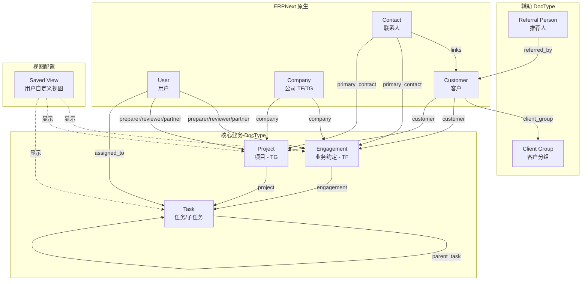

# 📄 Document A: Data Model - Refactoring Plan
# 数据模型 - 重构规划文档

**项目**: Smart Accounting  
**版本**: v3.0  
**日期**: 2025-12-09  
**状态**: 🔄 重构规划中 (Prototype 阶段)  
**重构策略**: ✅ **方案 B - 干净原生开始 (Clean Slate)**

---

## 目录

1. [重构决策（已确认）](#1-重构决策已确认)
2. [新架构概览](#2-新架构概览)
3. [核心 DocType 字段设计](#3-核心-doctype-字段设计)
4. [辅助 DocType](#4-辅助-doctype)
5. [删除的 DocType](#5-删除的-doctype)
6. [使用场景](#6-使用场景)
7. [实施步骤](#7-实施步骤)
8. [待确认问题](#8-待确认问题)

---

## 1. 重构决策（已确认）

### 1.1 重构策略

| 决策项 | 结果 | 日期 |
|--------|------|------|
| **重构方法** | ✅ 方案 B - Clean Slate (干净原生开始) | 2025-12-09 |
| **命名规范** | ✅ 直接业务名 (Engagement / Project / Task) | 2025-12-09 |
| **Task/Project** | ✅ 使用 ERPNext 原生，添加必要字段 | 2025-12-09 |
| **Engagement** | ✅ 新建 DocType | 2025-12-09 |

### 1.2 Clean Slate 意味着什么

| 层级 | 处理方式 |
|------|---------|
| **ERPNext 原生** | Customer / Contact / User / Company 保持原生，仅少量扩展 |
| **Task / Project** | 使用 ERPNext 原生 DocType，添加必要字段（非 custom_xxx 前缀）|
| **Engagement** | 全新创建 DocType |
| **Saved View** | 全新创建，替代 Partition |
| **现有数据** | 编写迁移脚本从旧结构转移 |

---

## 2. 新架构概览

### 2.1 核心设计理念

```
三种工作项类型 + 用户自定义视图：

- Engagement → TF（会计事务所）的主工作项
- Project    → TG（Grants）的项目管理  
- Task       → 子任务 或 独立任务
- Saved View → 替代 Partition，用户自定义显示字段
```

### 2.2 新架构关系图 (Mermaid)



### 2.3 两条 Workflow 链

```
┌─────────────────────────────────────────────────────────────────┐
│                    链条 1: TF (会计事务所)                        │
├─────────────────────────────────────────────────────────────────┤
│                                                                  │
│   Company ──┐                                                    │
│             ├──► Engagement (Job) ──► Task                      │
│   Customer ─┘                                                    │
│                                                                  │
│   示例: Top Figures + Client A → FY24 ITR → Collect Documents   │
│                                                                  │
└─────────────────────────────────────────────────────────────────┘

┌─────────────────────────────────────────────────────────────────┐
│                    链条 2: TG (Grants)                           │
├─────────────────────────────────────────────────────────────────┤
│                                                                  │
│   Company ──┐                                                    │
│             ├──► Project ──► Task                               │
│   Customer ─┘                                                    │
│                                                                  │
│   示例: Top Grants + Client B → R&D Grant 2024 → Submit Form    │
│                                                                  │
└─────────────────────────────────────────────────────────────────┘
```

### 2.4 开发顺序

> **从干净原生 ERPNext 开始，按链条顺序构建：**

```
Step 1: 基础层 (ERPNext 原生)
        └── Company, Customer, Contact, User ✅ 已有

Step 2: 链条 1 - TF
        ├── 创建 Engagement DocType
        └── 扩展 Task (添加 engagement 字段)

Step 3: 链条 2 - TG  
        └── 扩展 Project (添加必要字段)

Step 4: 视图层
        └── 创建 Saved View DocType
```

---

## 3. 核心 DocType 字段设计

### 3.1 Engagement（TF 业务约定）

> **定位**：TF（会计事务所）的主工作项，替代当前 Task 承载的业务功能

| 字段 | 字段名 | 类型 | 必填 | 来源 | 说明 |
|------|--------|------|------|------|------|
| **核心字段** ||||||
| 标题 | `title` | Data | ✅ | 新增 | 约定标题，如 "Client A - FY24 ITR" |
| 客户 | `customer` | Link → Customer | ✅ | Task.custom_client | 所属客户 |
| 公司 | `company` | Link → Company | ✅ | Task.custom_tftg | TF/TG 公司 |
| 服务类型 | `type` | Select | ✅ | Task.custom_service_line | ITR/BAS/Bookkeeping/... |
| 状态 | `status` | Select | ✅ | Task.custom_task_status | 工作状态 |
| **团队分配（JSON 方案）** ||||||
| 团队 | `team` | JSON | | Task.custom_roles | 存储所有角色人员，见下方格式 |
| 团队成员 | `team_members` | Data | | 新增 | 辅助筛选字段（逗号分隔）|
| **时间字段** ||||||
| 财年 | `fiscal_year` | Data | | Task.custom_year_end | 如 "FY24" |
| 目标月份 | `target_month` | Select | | Task.custom_target_month | January~December |
| 截止日期 | `due_date` | Date | | Task.custom_lodgement_due_date | 内部截止 |
| 提交日期 | `lodgement_date` | Date | | 新增 | 实际提交日期 |
| **财务字段** ||||||
| 预算 | `budget` | Currency | | Task.custom_budget_planning | 预算金额 |
| 实际账单 | `actual_billing` | Currency | | Task.custom_actual_billing | 实际收费 |
| **业务字段** ||||||
| 频率 | `frequency` | Select | | Task.custom_frequency | Annually/Quarterly/Monthly/... |
| 银行交易 | `bank_transactions` | Select | | Task.custom_bank_transactions | Client to Provide/Integrated |
| 主要联系人 | `primary_contact` | Link → Contact | | 保留 | 客户联系人 |
| **子表** ||||||
| 使用软件 | `softwares` | Table → Software Item | | Task.custom_softwares | Xero/MYOB/... |
| 沟通方式 | `communication_methods` | Table | | Task.custom_communication_methods | 沟通记录 |
| 审核备注 | `review_notes` | Table → Review Note | | Task.custom_review_notes | 审核意见 |
| **其他** ||||||
| 备注 | `notes` | Text | | Task.custom_note | 备注 |
| 已归档 | `is_archived` | Check | | Task.custom_is_archived | 归档标记 |

**团队 JSON 格式**：
```json
{
  "preparers": ["bob@tf.com", "david@tf.com"],
  "reviewers": ["charlie@tf.com"],
  "partners": ["alice@tf.com"]
}
```

> **为什么用 JSON？** Monday.com 风格的多人分配 UI 需要：
> - 列表加载快（无需 JOIN 子表）
> - 前端直接解析显示多人头像
> - 点击即弹出选择器，可多选

**状态选项（待确认）**：
```
Not Started → Working → Ready for Review → Under Review → Completed
```

---

### 3.2 Project（TG 项目）

> **定位**：TG（Grants）的项目管理，使用 ERPNext 原生 Project，添加必要字段

| 字段 | 字段名 | 类型 | 必填 | 说明 |
|------|--------|------|------|------|
| **核心字段（原生）** |||||
| 项目名称 | `project_name` | Data | ✅ | ERPNext 原生 |
| 状态 | `status` | Select | ✅ | ERPNext 原生 |
| **扩展字段** |||||
| 客户 | `customer` | Link → Customer | ✅ | 所属客户 |
| 公司 | `company` | Link → Company | ✅ | TG 公司 |
| 项目类型 | `type` | Select | ✅ | R&D Grant/Export Grant/... |
| **团队分配（JSON 方案）** |||||
| 团队 | `team` | JSON | | 同 Engagement 格式 |
| 团队成员 | `team_members` | Data | | 辅助筛选字段 |
| **时间字段** |||||
| 开始日期 | `start_date` | Date | | 项目开始 |
| 结束日期 | `end_date` | Date | | 项目结束 |
| 提交截止 | `submission_deadline` | Date | | 提交截止日期 |
| **财务字段** |||||
| 预算 | `budget` | Currency | | 项目预算 |
| 补贴金额 | `grant_amount` | Currency | | 申请/获批金额 |
| 实际成本 | `actual_cost` | Currency | | 实际花费 |
| **其他** |||||
| 主要联系人 | `primary_contact` | Link → Contact | | 客户联系人 |
| 备注 | `notes` | Text | | 备注 |
| 已归档 | `is_archived` | Check | | 归档标记 |

---

### 3.3 Task（任务/子任务）

> **定位**：可作为 Engagement/Project 的子任务，也可独立使用

| 字段 | 字段名 | 类型 | 必填 | 说明 |
|------|--------|------|------|------|
| **核心字段（原生）** |||||
| 任务名称 | `subject` | Data | ✅ | ERPNext 原生 |
| 状态 | `status` | Select | ✅ | ERPNext 原生 |
| **关联字段** |||||
| 所属约定 | `engagement` | Link → Engagement | | TF 业务约定 |
| 所属项目 | `project` | Link → Project | | TG 项目 / ERPNext 原生 |
| 父任务 | `parent_task` | Link → Task | | 子任务时填写 |
| **人员字段** |||||
| 负责人 | `assigned_to` | Link → User | | 任务负责人 |
| **独立使用时** |||||
| 客户 | `customer` | Link → Customer | | 独立任务时填写 |
| **时间字段** |||||
| 截止日期 | `due_date` | Date | | 任务截止 |
| 完成日期 | `completed_date` | Date | | 实际完成 |
| **其他** |||||
| 优先级 | `priority` | Select | | Low/Medium/High |
| 备注 | `notes` | Text | | 备注 |
| 排序 | `sequence` | Int | | 在父级下的排序 |
| 审核备注 | `review_notes` | Table → Review Note | | 审核意见 |

**字段继承逻辑**：
```
如果 Task 有父级 Engagement/Project:
  - customer/company 从父级继承（无需填写）
  - assigned_to 可以覆盖父级的 preparer

如果 Task 独立使用:
  - customer 自己填写
```

---

### 3.4 Saved View（视图配置）

> **定位**：替代 Partition，用户自定义显示哪些字段

| 字段 | 字段名 | 类型 | 必填 | 说明 |
|------|--------|------|------|------|
| **核心字段** |||||
| 视图名称 | `title` | Data | ✅ | 如 "ITR Progress View" |
| 视图类型 | `view_type` | Select | ✅ | system / tenant / personal |
| 目标 DocType | `target_doctype` | Select | ✅ | Engagement / Project / Task |
| **配置字段** |||||
| 业务类型筛选 | `type_filter` | Data | | 筛选特定 type |
| 筛选条件 | `filters` | JSON | | 其他筛选条件 |
| 可见列 | `visible_columns` | JSON | ✅ | 显示哪些列 |
| 列顺序 | `column_order` | JSON | | 列的排列顺序 |
| 列宽 | `column_widths` | JSON | | 各列宽度 |
| 排序字段 | `sort_by` | Data | | 默认排序 |
| **权限字段** |||||
| 创建者 | `owner` | Link → User | | personal view 的创建者 |
| 所属公司 | `company` | Link → Company | | 租户隔离 |
| **标记** |||||
| 是否默认 | `is_default` | Check | | 该 Type 的默认视图 |
| 可删除 | `is_deletable` | Check | | 系统默认 = false |

**视图层级**：
```
1️⃣ System Default (系统默认) - 不可删除
2️⃣ Tenant Custom (租户自定义) - 租户内共享
3️⃣ User Personal (用户个人) - 仅自己可见

优先级: Personal > Tenant > System
```

---

## 4. 辅助 DocType

### 4.1 保留的独立 DocType

| DocType | 用途 | 处理 | 说明 |
|---------|------|------|------|
| **Client Group** | 客户分组 | ✅ 保留 | 无需修改 |
| **Referral Person** | 推荐人 | ✅ 保留 | 无需修改 |
| **User Preferences** | 用户偏好 | ✅ 保留 | 可扩展存 View 配置 |

### 4.2 保留的子表 DocType

| DocType | 用途 | 被谁使用 | 处理 |
|---------|------|---------|------|
| **Review Note** | 审核备注 | Engagement / Task | ✅ 保留，共用 |
| **Software Item** | 使用软件 | Engagement | ✅ 保留，改名 |
| **Communication Method** | 沟通方式 | Engagement | ✅ 保留，改名 |
| **Customer Company Tag** | 关联公司 | Customer | ✅ 保留 |
| **Contact Social** | 社交账号 | Contact | ✅ 保留 |

### 4.3 ERPNext 原生 DocType 扩展

| DocType | 扩展字段 | 说明 |
|---------|---------|------|
| **Customer** | `referred_by` → Referral Person | 推荐人 |
| | `client_group` → Client Group | 客户分组 |
| | `entity_type` (Select) | 实体类型 |
| | `year_end` (Select) | 财年结束月 |
| | `associated_companies` (Table) | 关联公司 |
| **Contact** | `contact_role` (Select) | 联系人角色 |
| | `social_accounts` (Table) | 社交账号 |
| | `notes` (Text) | 备注 |

---

## 5. 删除的 DocType

| DocType | 原因 | 替代方案 |
|---------|------|---------|
| **Service Line** | 冗余 | Engagement/Project 的 `type` 字段 |
| **Partition** | 不够灵活 | Saved View |
| **Task Role Assignment** | ✅ 确认删除 | Engagement/Project 的 `team` JSON 字段 |
| **Combination View** | 被替代 | Saved View |
| **Combination View Board** | 被替代 | Saved View |
| **Board Column** | 被替代 | Saved View JSON 配置 |
| **Board Cell** | 被替代 | Saved View JSON 配置 |

---

## 6. 使用场景

### 6.1 场景 1：只用 Engagement（简单模式）

> 适用于：大多数会计事务所日常工作

```
列表视图（类似 Monday.com）：
┌─────────────┬────────────────┬──────────┬──────────┬──────────┬─────────┐
│ Client      │ Job Name       │ Preparer │ Reviewer │ Partner  │ Status  │
├─────────────┼────────────────┼──────────┼──────────┼──────────┼─────────┤
│ Client A    │ FY24 ITR       │ Bob      │ Charlie  │ Alice    │ Working │
│ Client B    │ FY24 BAS       │ David    │ Charlie  │ Alice    │ Review  │
│ Client C    │ FY24 Company   │ Eva      │ Frank    │ Alice    │ Done    │
└─────────────┴────────────────┴──────────┴──────────┴──────────┴─────────┘
```

### 6.2 场景 2：Engagement + Task（详细模式）

> 适用于：需要追踪执行步骤的复杂工作

```
Engagement: Client A - FY24 ITR
├── Preparer: Bob
├── Reviewer: Charlie  
├── Partner: Alice
├── Status: In Progress
│
└── Tasks (执行步骤):
    ├── Task 1: Collect Documents     [Done]
    ├── Task 2: Prepare Return        [Working] - Bob
    ├── Task 3: Manager Review        [Pending] - Charlie
    ├── Task 4: Partner Review        [Pending] - Alice
    └── Task 5: Lodge to ATO          [Pending]
```

### 6.3 场景 3：只用 Task（快速模式）

> 适用于：临时任务、快速记录

```
Task 列表：
┌─────────────┬────────────────┬──────────┬─────────┐
│ Client      │ Task Name      │ Assigned │ Status  │
├─────────────┼────────────────┼──────────┼─────────┤
│ Client A    │ 回复 ATO 询问   │ Bob      │ Working │
│ Client B    │ 补充材料        │ David    │ Done    │
└─────────────┴────────────────┴──────────┴─────────┘
```

---

## 7. 实施步骤

### Phase 1: DocType 设计与创建
- [ ] 创建 Engagement DocType
- [ ] 创建 Saved View DocType
- [ ] 扩展 Project 字段
- [ ] 扩展 Task 字段

### Phase 2: 默认 View 配置
- [ ] 为 ITR/BAS/Bookkeeping 等创建默认 View
- [ ] 实现 View 保存/加载机制

### Phase 3: 数据迁移
- [ ] 编写 Task → Engagement 迁移脚本
- [ ] 编写 Partition → Saved View 迁移脚本
- [ ] 测试数据完整性

### Phase 4: 前端改造
- [ ] 实现统一列表视图
- [ ] 实现 View 选择/编辑功能
- [ ] 适配新数据结构

---

## 8. 待确认问题

| 问题 | 状态 | 备注 |
|------|------|------|
| 人员分配方案？ | ✅ 已确认 | JSON 字段 `team`，支持 Monday.com 风格多人分配 |
| Engagement 状态选项具体列表？ | ⏳ 待确认 | 参考当前 Task 状态 |
| `reset_date` 和 `process_date` 用途？ | ⏳ 待确认 | 是否需要迁移到 Engagement |
| 是否需要 `referral_person` 在 Engagement？ | ⏳ 待确认 | 当前 Engagement 有此字段 |
| Type 分类最终列表？ | ⏳ 待确认 | ITR/BAS/Bookkeeping/... |

---

## 附录

### A. 相关文档

| 文档 | 说明 |
|------|------|
| `docs/A_Data_Model_Assessment.md` | 新数据模型重构规划（本文档）|
| `docs/B_Code_Architecture_Review.md` | 代码架构重构规划 |
| `docs/C_Business_Process_Flows.md` | 业务流程文档 |
| `docs/D_Current_Data_Architecture.md` | **当前数据架构参考** ⭐ |

### B. 修订历史

| 版本 | 日期 | 修改内容 |
|------|------|---------|
| 1.0 | 2025-12-01 | 初始版本 |
| 2.0 | 2025-12-08 | 改为重构参考文档；Engagement/Project 同级设计 |
| 2.5 | 2025-12-09 | 确认重构策略 (Clean Slate)；确认命名规范 |
| 3.0 | 2025-12-09 | 大幅重构文档结构；添加 Mermaid 关系图；统一字段表格格式 |
| 3.1 | 2025-12-09 | **确认人员分配方案**：JSON 字段 `team` 替代子表；**添加两条 Workflow 链**；**添加开发顺序** |
