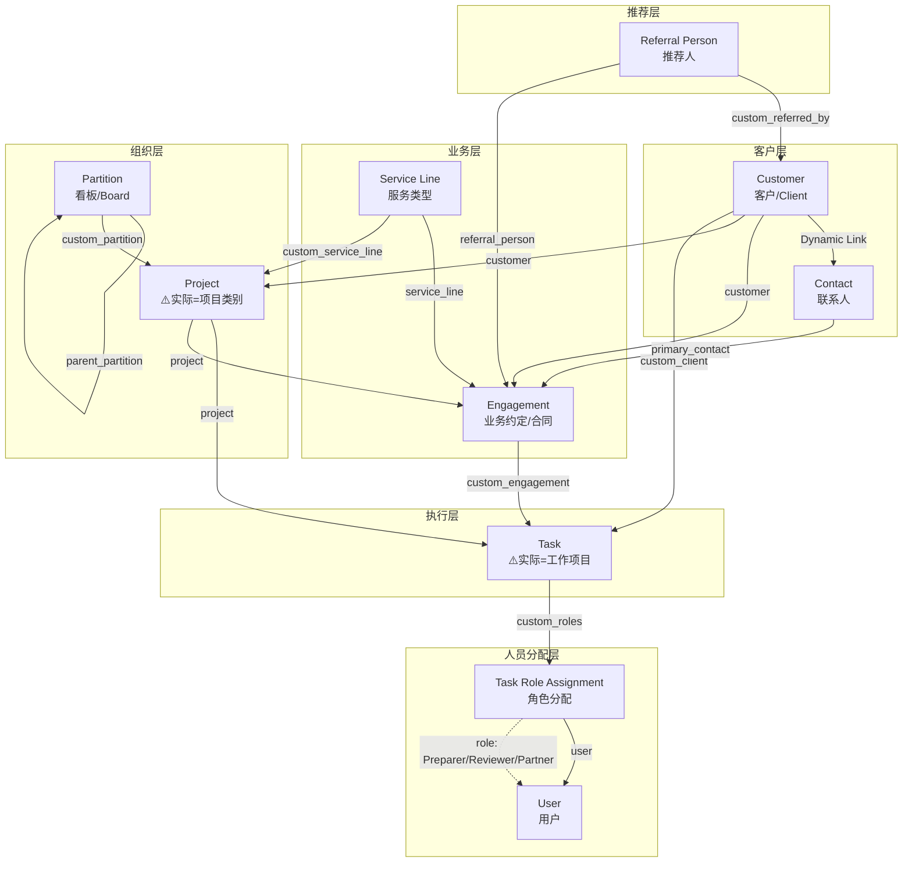

# 📄 Document D: Current Data Architecture
# 当前数据架构文档

**项目**: Smart Accounting  
**版本**: v1.1  
**日期**: 2025-12-09  
**用途**: 🔍 **参考文档** - 记录重构前的现有数据结构

---

## 文档目的

> **本文档记录当前系统的数据架构现状。**
> 
> - 作为重构的参考基线
> - 方便随时查看现有结构
> - 对比新旧设计的差异

---

## 1. 概念映射说明

> ⚠️ **重要**：ERPNext 原生名称 vs 实际业务概念存在"错级"

| ERPNext DocType | 实际业务概念 | 说明 |
|-----------------|-------------|------|
| **Task** | 📋 **工作项目 (Work Item)** | 表格中每一行，对应一个客户的一项具体工作 |
| **Project** | 📁 **项目类别 (Project Category)** | 按年度+服务类型分类 Tasks，如"FY2024 Tax Returns" |
| **Partition** | 🗂️ **看板/工作区 (Board)** | UI 层面的视图组织，如"Top Figures" |
| **Service Line** | 🏷️ **服务类型 (Service Type)** | 服务分类，如"Individual Tax Return" |
| **Engagement** | 📝 **业务约定 (Contract)** | 与客户签订的服务协议 |
| **Customer** | 👤 **客户 (Client)** | 客户，无变化 |
| **Contact** | 📞 **联系人 (Contact)** | 联系人，无变化 |
| **Referral Person** | 🤝 **推荐人 (Referrer)** | 推荐人，无变化 |

---

## 2. 整体关系流程图



---

## 3. 层级结构图

```
Partition (看板/Board - UI视图组织)
    └── Project (⚠️实际=项目类别，如"FY2024 Tax Returns")
            ├── custom_service_line -> Service Line (服务类型)
            └── Task (⚠️实际=工作项目，表格中的每一行)
                    ├── custom_client -> Customer (客户)
                    ├── custom_engagement -> Engagement (业务约定)
                    └── custom_roles -> Task Role Assignment (角色分配)
                            ├── Preparer -> User (准备人)
                            ├── Reviewer -> User (审核人)
                            └── Partner -> User (合伙人)
```

---

## 4. 详细字段关系表

### 4.1 Task (任务/工作项目)

| 字段名 | 类型 | Link 到 | 说明 |
|--------|------|---------|------|
| project | Link | Project | 所属项目 |
| parent_task | Link | Task | 父任务(subtask用) |
| custom_client | Link | Customer | 所属客户 |
| custom_tftg | Link | Company | TF/TG公司 |
| custom_engagement | Link | Engagement | 关联业务约定 |
| custom_service_line | Link | Service Line | 服务类型 |
| custom_roles | Table | Task Role Assignment | 角色分配(多人) |
| custom_softwares | Table | Task Software | 使用软件(多选) |
| custom_review_notes | Table | Review Note | 审核备注 |
| custom_communication_methods | Table | Task Communication Method | 沟通方式 |
| custom_task_status | Select | - | 自定义状态 |
| custom_target_month | Select | - | 目标月份 |
| custom_year_end | Select | - | 财年结束月 |
| custom_lodgement_due_date | Date | - | 提交截止日期 |
| custom_due_date | Date | - | 截止日期(子任务用) |
| custom_budget_planning | Currency | - | 预算 |
| custom_actual_billing | Currency | - | 实际账单 |
| custom_frequency | Select | - | 频率 |
| custom_reset_date | Date | - | 重置日期 |
| custom_process_date | Date | - | 处理日期 |
| custom_bank_transactions | Select | - | 银行交易来源 |
| custom_note | Long Text | - | 备注 |
| custom_sequence | Int | - | 排序序号 |
| custom_is_archived | Check | - | 是否归档 |

### 4.2 Project (项目/项目类别)

| 字段名 | 类型 | Link 到 | 说明 |
|--------|------|---------|------|
| customer | Link | Customer | 所属客户 |
| custom_partition | Link | Partition | 所属分区 ⭐必填 |
| custom_service_line | Link | Service Line | 服务类型 |
| custom_is_archived | Check | - | 是否归档 |

### 4.3 Engagement (业务约定)

| 字段名 | 类型 | Link 到 | 说明 |
|--------|------|---------|------|
| customer | Link | Customer | 所属客户 ⭐必填 |
| company | Link | Company | 所属公司 |
| project | Link | Project | 关联项目 |
| service_line | Link | Service Line | 服务类型 |
| referral_person | Link | Referral Person | 推荐人 |
| fiscal_year | Link | Fiscal Year | 财年 ⭐必填 |
| owner_partner | Link | User | 负责合伙人 |
| primary_contact | Link | Contact | 主要联系人 |
| accounting_contact | Link | Contact | 会计联系人 |
| tax_contact | Link | Contact | 税务联系人 |
| grants_contact | Link | Contact | 补助联系人 |
| frequency | Select | - | 频率 |
| engagement_letter | Attach | - | 约定书附件 |

### 4.4 Partition (分区/Board)

| 字段名 | 类型 | Link 到 | 说明 |
|--------|------|---------|------|
| partition_name | Data | - | 分区名称 ⭐必填唯一 |
| parent_partition | Link | Partition | 父分区(层级) |
| is_workspace | Check | - | 是否为工作区 |
| display_type | Select | - | 显示类型(table/board) |
| visible_columns | Long Text | - | 可见列配置JSON |
| column_config | Long Text | - | 列配置JSON |

### 4.5 Service Line (服务线)

| 字段名 | 类型 | Link 到 | 说明 |
|--------|------|---------|------|
| code | Data | - | 服务代码 ⭐必填唯一 |
| service_name | Data | - | 服务名称 ⭐必填 |
| category | Select | - | 分类(Tax/BAS/Bookkeeping等) |
| is_active | Check | - | 是否启用 |

### 4.6 Customer (客户) - 自定义字段

| 字段名 | 类型 | Link 到 | 说明 |
|--------|------|---------|------|
| custom_referred_by | Link | Referral Person | 推荐人 |
| custom_associated_companies | Table | Customer Company Tag | 关联公司(多选) |
| custom_entity_type | Select | - | 实体类型 |
| custom_year_end | Select | - | 财年结束月 |
| custom_client_group | Link | Client Group | 客户组 |

### 4.7 Contact (联系人) - 自定义字段

| 字段名 | 类型 | Link 到 | 说明 |
|--------|------|---------|------|
| custom_contact_role | Select | - | 联系人角色 |
| custom_social_app | Table | Contact Social | 社交账号 |
| custom_contact_notes | Text | - | 备注 |
| custom_last_contact_date | Date | - | 最后联系日期 |
| is_billing_contact | Check | - | 是否账单联系人 |

### 4.8 Referral Person (推荐人)

| 字段名 | 类型 | Link 到 | 说明 |
|--------|------|---------|------|
| referral_person_name | Data | - | 推荐人名称 ⭐必填唯一 |
| contact_information | Link | Contact | 联系信息 |
| phone_number | Data | - | 电话 |
| email_address | Data | - | 邮箱 |
| referral_type | Select | - | 推荐人类型 |

### 4.9 Client Group (客户组)

| 字段名 | 类型 | Link 到 | 说明 |
|--------|------|---------|------|
| group_name | Data | - | 组名称 ⭐必填唯一 |
| primary_contact | Link | Customer | 主联系客户 |
| description | Text Editor | - | 描述 |
| created_date | Date | - | 创建日期 |

### 4.10 User Preferences (用户偏好)

| 字段名 | 类型 | Link 到 | 说明 |
|--------|------|---------|------|
| user | Link | User | 用户 ⭐必填唯一 |
| column_widths | Long Text | - | 列宽配置 JSON |
| subtask_column_widths | Long Text | - | 子任务列宽配置 JSON |

---

## 5. 子表 DocType

### 5.1 Task Role Assignment (任务角色分配)

| 字段名 | 类型 | Link 到 | 说明 |
|--------|------|---------|------|
| role | Select | - | 角色类型(Action Person/Preparer/Reviewer/Partner/Owner) |
| user | Link | User | 分配的用户 |
| is_primary | Check | - | 是否为主要负责人 |

### 5.2 Task Software (任务软件)

| 字段名 | 类型 | 说明 |
|--------|------|------|
| software | Select | 软件(Xero/MYOB/QuickBooks/Excel/Payroller/Other) |
| is_primary | Check | 是否主要软件 |

### 5.3 Review Note (审核备注)

| 字段名 | 类型 | Link 到 | 说明 |
|--------|------|---------|------|
| reviewer | Link | User | 审核人 |
| note | Text Editor | - | 备注内容 |
| created_on | Datetime | - | 创建时间 |

### 5.4 Task Communication Method (沟通方式)

| 字段名 | 类型 | 说明 |
|--------|------|------|
| 沟通相关字段 | - | 待补充 |

### 5.5 Customer Company Tag (客户关联公司)

| 字段名 | 类型 | 说明 |
|--------|------|------|
| 公司关联字段 | - | 待补充 |

### 5.6 Contact Social (联系人社交账号)

| 字段名 | 类型 | 说明 |
|--------|------|------|
| 社交账号字段 | - | 待补充 |

---

## 6. 使用场景示例

```
【场景】会计事务所的税务申报工作

Service Line (服务类型): "Individual Tax Return"

Partition (看板): "Financials and Tax Returns"
    │
    ├── Project (项目类别): "FY2024 Financials and Tax Returns"
    │       ├── custom_service_line -> "Individual Tax Return"
    │       │
    │       ├── Task (工作项目): ZHANG, Kaiyi 的FY2024税务申报
    │       │       ├── custom_client -> "ZHANG, Kaiyi"
    │       │       ├── Status: "Working On It"
    │       │       └── Action Person: JR
    │       │
    │       └── Task (工作项目): David Tao 的FY2024税务申报
    │               ├── custom_client -> "David Tao"
    │               ├── Status: "Ready To Lodge"
    │               └── Action Person: JW
    │
    └── Project (项目类别): "FY2025 Financials and Tax Returns"
            ├── custom_service_line -> "Individual Tax Return"
            │
            ├── Task (工作项目): 318 Construction Service P 的FY2025税务申报
            └── Task (工作项目): 3J Effect Pty Ltd 的FY2025税务申报
```

---

## 7. 当前架构问题总结

| 问题 | 影响 | 新设计解决方案 |
|------|------|---------------|
| Task 有 24 个 custom_xxx 字段 | 字段命名不规范，查询繁琐 | Clean Slate 重新设计 |
| Project 语义错位 | 代码中的"project"和业务中的"项目"含义不同 | 回归原生语义 |
| Partition 不够灵活 | 视图配置受限 | 用 Saved View 替代 |
| Service Line 冗余 | 可以用 type 字段替代 | 删除，用 type 字段 |
| Engagement 与 Task 重叠 | 数据冗余，定位模糊 | 明确 Engagement 为主工作项 |
| Task Role Assignment 过度设计 | 查询复杂 | 改为直接字段 |

---

## 附录

### A. 相关文档

- `docs/A_Data_Model_Assessment.md` - 新数据模型重构规划
- `docs/B_Code_Architecture_Review.md` - 代码架构重构规划
- `docs/C_Business_Process_Flows.md` - 业务流程文档

### B. 修订历史

| 版本 | 日期 | 修改内容 |
|------|------|---------|
| 1.0 | 2025-11 | 初始版本 |
| 1.1 | 2025-12-09 | 移动到 docs/ 文件夹，补充完整字段，添加问题总结 |

