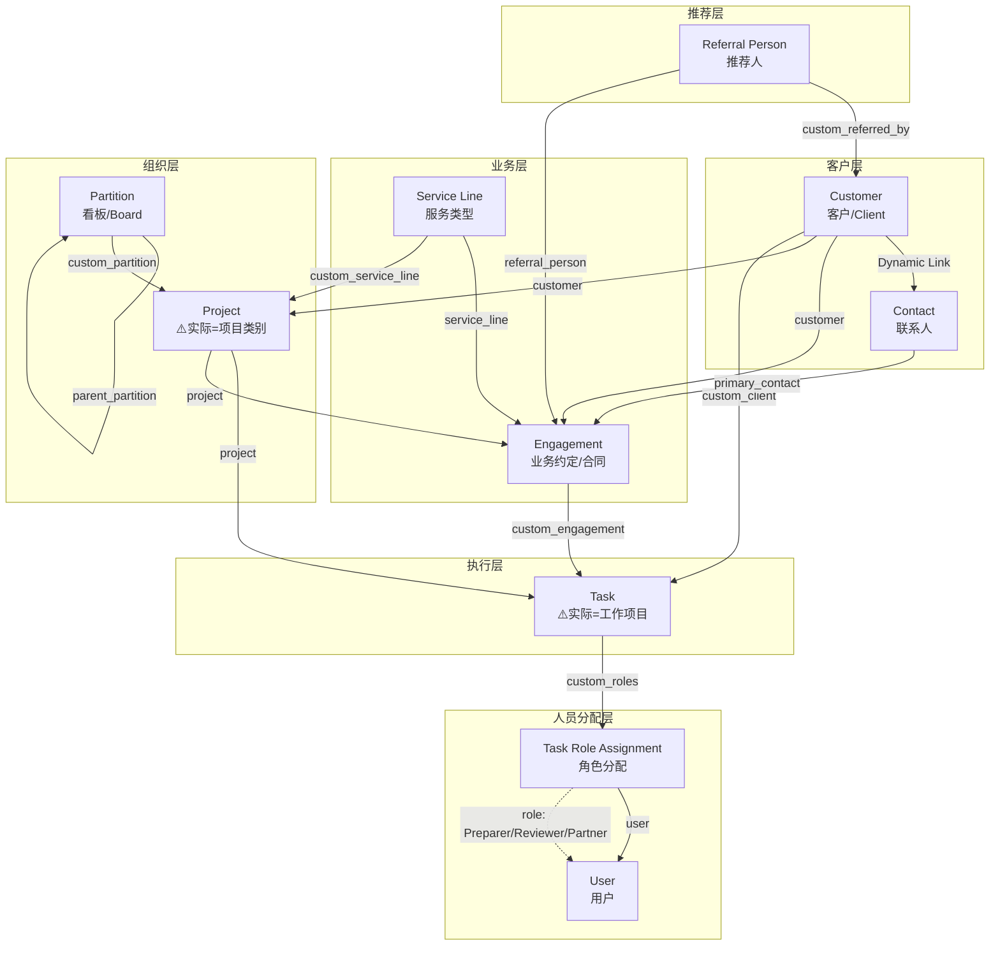

# Smart Accounting 核心数据架构

## ⚠️ 重要：概念映射说明

**ERPNext原生名称 vs 实际业务概念存在"错级"，请注意区分：**

| ERPNext DocType | 实际业务概念 | 说明 |
|-----------------|-------------|------|
| **Task** | 📋 **工作项目 (Work Item)** | 表格中每一行，对应一个客户的一项具体工作 |
| **Project** | 📁 **项目类别 (Project Category)** | 按年度+服务类型分类Tasks，如"FY2024 Tax Returns" |
| **Partition** | 🗂️ **看板/工作区 (Board)** | UI层面的视图组织，如"Top Figures" |
| **Service Line** | 🏷️ **服务类型 (Service Type)** | 服务分类，如"Individual Tax Return" |
| **Engagement** | 📝 **业务约定 (Contract)** | 与客户签订的服务协议 |
| **Customer** | 👤 **客户 (Client)** | 客户，无变化 |
| **Contact** | 📞 **联系人 (Contact)** | 联系人，无变化 |
| **Referral Person** | 🤝 **推荐人 (Referrer)** | 推荐人，无变化 |

---

## 1. 整体关系流程图（按实际业务概念）



---

## 2. 详细字段关系表

### Task (任务)
| 字段名 | 类型 | Link到 | 说明 |
|--------|------|--------|------|
| project | Link | Project | 所属项目 |
| parent_task | Link | Task | 父任务(subtask用) |
| custom_client | Link | Customer | 所属客户 |
| custom_tftg | Link | Company | TF/TG公司 |
| custom_engagement | Link | Engagement | 关联业务约定 |
| custom_roles | Table | Task Role Assignment | 角色分配(多人) |
| custom_softwares | Table | Task Software | 使用软件(多选) |
| custom_review_notes | Table | Review Note | 审核备注 |
| custom_communication_methods | Table | Task Communication Method | 沟通方式 |
| custom_task_status | Select | - | 自定义状态 |
| custom_target_month | Select | - | 目标月份 |
| custom_budget_planning | Currency | - | 预算 |
| custom_actual_billing | Currency | - | 实际账单 |

### Project (项目)
| 字段名 | 类型 | Link到 | 说明 |
|--------|------|--------|------|
| customer | Link | Customer | 所属客户 |
| custom_partition | Link | Partition | 所属分区 ⭐必填 |
| custom_service_line | Link | Service Line | 服务类型 |
| custom_is_archived | Check | - | 是否归档 |

### Engagement (业务约定)
| 字段名 | 类型 | Link到 | 说明 |
|--------|------|--------|------|
| customer | Link | Customer | 所属客户 ⭐必填 |
| company | Link | Company | 所属公司 |
| project | Link | Project | 关联项目 |
| service_line | Link | Service Line | 服务类型 |
| referral_person | Link | Referral Person | 推荐人 |
| fiscal_year | Link | Fiscal Year | 财年 ⭐必填 |
| owner_partner | Link | User | 负责合伙人 |
| primary_contact | Link | Contact | 主要联系人 |
| accounting_contact | Link | Contact | 会计联系人 |
| tax_contact | Link | Contact | 税务联系人 |
| grants_contact | Link | Contact | 补助联系人 |
| frequency | Select | - | 频率 |
| engagement_letter | Attach | - | 约定书附件 |

### Partition (分区/Board)
| 字段名 | 类型 | Link到 | 说明 |
|--------|------|--------|------|
| partition_name | Data | - | 分区名称 ⭐必填唯一 |
| parent_partition | Link | Partition | 父分区(层级) |
| is_workspace | Check | - | 是否为工作区 |
| display_type | Select | - | 显示类型(table/board) |
| visible_columns | Long Text | - | 可见列配置JSON |
| column_config | Long Text | - | 列配置JSON |

### Service Line (服务线)
| 字段名 | 类型 | Link到 | 说明 |
|--------|------|--------|------|
| code | Data | - | 服务代码 ⭐必填唯一 |
| service_name | Data | - | 服务名称 ⭐必填 |
| category | Select | - | 分类(Tax/BAS/Bookkeeping等) |
| is_active | Check | - | 是否启用 |

### Customer (客户) - 自定义字段
| 字段名 | 类型 | Link到 | 说明 |
|--------|------|--------|------|
| custom_referred_by | Link | Referral Person | 推荐人 |
| custom_associated_companies | Table | Customer Company Tag | 关联公司(多选) |
| custom_entity_type | Select | - | 实体类型 |
| custom_year_end | Select | - | 财年结束月 |
| custom_client_group | Link | Client Group | 客户组 |

### Contact (联系人) - 自定义字段
| 字段名 | 类型 | Link到 | 说明 |
|--------|------|--------|------|
| custom_contact_role | Select | - | 联系人角色 |
| custom_social_app | Table | Contact Social | 社交账号 |
| custom_contact_notes | Text | - | 备注 |
| custom_last_contact_date | Date | - | 最后联系日期 |

### Referral Person (推荐人)
| 字段名 | 类型 | Link到 | 说明 |
|--------|------|--------|------|
| referral_person_name | Data | - | 推荐人名称 ⭐必填唯一 |
| contact_information | Link | Contact | 联系信息 |
| phone_number | Data | - | 电话 |
| email | Data | - | 邮箱 |

### Task Role Assignment (任务角色分配) - 子表
| 字段名 | 类型 | Link到 | 说明 |
|--------|------|--------|------|
| parent | Link | Task | 所属任务 |
| role | Select | - | 角色类型(Preparer/Reviewer/Partner) |
| user | Link | User | 分配的用户 |
| is_primary | Check | - | 是否为主要负责人 |

---

## 3. 层级结构（按实际业务概念标注）

```
Partition (看板/Board - UI视图组织)
    └── Project (⚠️实际=项目类别，如"FY2024 Tax Returns")
            ├── custom_service_line -> Service Line (服务类型)
            └── Task (⚠️实际=工作项目，表格中的每一行)
                    ├── custom_client -> Customer (客户)
                    ├── custom_engagement -> Engagement (业务约定)
                    └── custom_roles -> Task Role Assignment (角色分配)
                            ├── Preparer -> User (准备人)
                            ├── Reviewer -> User (审核人)
                            └── Partner -> User (合伙人)
```

---

## 4. 使用场景示例（按实际业务理解）

```
【场景】会计事务所的税务申报工作

Service Line (服务类型): "Individual Tax Return"

Partition (看板): "Financials and Tax Returns"
    │
    ├── Project (项目类别): "FY2024 Financials and Tax Returns"
    │       ├── custom_service_line -> "Individual Tax Return"
    │       │
    │       ├── Task (工作项目): ZHANG, Kaiyi 的FY2024税务申报
    │       │       ├── custom_client -> "ZHANG, Kaiyi"
    │       │       ├── Status: "Working On It"
    │       │       └── Action Person: JR
    │       │
    │       └── Task (工作项目): David Tao 的FY2024税务申报
    │               ├── custom_client -> "David Tao"
    │               ├── Status: "Ready To Lodge"
    │               └── Action Person: JW
    │
    └── Project (项目类别): "FY2025 Financials and Tax Returns"
            ├── custom_service_line -> "Individual Tax Return"
            │
            ├── Task (工作项目): 318 Construction Service P 的FY2025税务申报
            └── Task (工作项目): 3J Effect Pty Ltd 的FY2025税务申报
```

---

## 5. 概念错级总结

### 为什么会有这个错级？

ERPNext原生设计是为了通用项目管理：
- **Project** = 一个完整的项目（有开始、结束、里程碑）
- **Task** = 项目中的一个小任务

但在会计事务所场景中：
- 每个客户的每项服务（如税务申报）本身就是一个**独立的工作项目**
- 需要把同类型、同时期的工作**批量管理**

所以你们的使用方式是：
- **Task** = 一个客户的一项服务工作（这才是真正的"项目"）
- **Project** = 把同类工作归组（这只是"项目类别"）

### 这样设计合理吗？

**目前是可行的**，因为：
1. Task有足够的字段来承载工作项目所需的信息
2. Project作为分组可以方便批量查看和管理
3. Partition提供了灵活的看板视图

**潜在问题**：
1. 语义混乱 - 代码中的"project"和业务中的"项目"含义不同
2. 如果将来需要Task下再有子任务（subtask），层级会更复杂
3. Engagement的定位可能需要重新考虑（是否与Task重复？）
