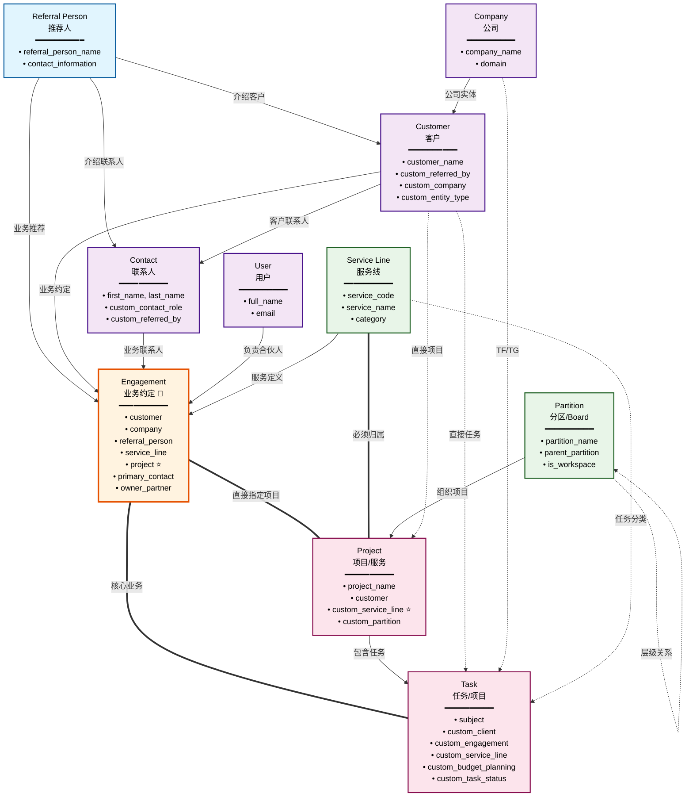

# Smart Accounting SaaS 核心数据流架构

## 🔄 核心数据流详细图



## 📋 核心数据流关系表

| 源DocType | 目标DocType | 关系字段 | 关系类型 | 业务含义 |
|-----------|-------------|----------|----------|----------|
| **推荐流程** | | | | |
| Referral Person | Contact | contact_information | 1:1 | 推荐人的联系方式 |
| Referral Person | Customer | custom_referred_by | 1:N | 推荐人介绍的客户 |
| Referral Person | Contact | custom_referred_by | 1:N | 推荐人介绍的联系人 |
| Referral Person | Engagement | referral_person | 1:N | 推荐人负责的业务约定 |
| **客户管理** | | | | |
| Company | Customer | custom_company | 1:N | 公司下的客户实体 |
| Customer | Contact | Dynamic Link | 1:N | 客户的联系人 |
| Customer | Engagement | customer | 1:N | 客户的业务约定 |
| Customer | Project | customer | 1:N | 客户的项目 |
| Customer | Task | custom_client | 1:N | 客户的任务 |
| **业务约定** | | | | |
| Contact | Engagement | primary_contact | N:1 | 主要联系人 |
| Contact | Engagement | accounting_contact | N:1 | 会计联系人 |
| Contact | Engagement | tax_contact | N:1 | 税务联系人 |
| Contact | Engagement | grants_contact | N:1 | 补助联系人 |
| Service Line | Engagement | service_line | 1:N | 服务线的业务约定 |
| Project | Engagement | project | 1:N | **新增** 项目的业务约定 |
| User | Engagement | owner_partner | 1:N | 负责合伙人 |
| Engagement | Task | custom_engagement | 1:N | 业务约定的任务 |
| **项目层级** | | | | |
| Partition | Partition | parent_partition | 1:N | 分区层级关系 |
| Partition | Project | custom_partition | 1:N | 分区下的项目 |
| Service Line | Project | custom_service_line | 1:N | **强化** 服务线必须归属项目 |
| Project | Task | project | 1:N | 项目下的任务 |
| **任务关联** | | | | |
| Service Line | Task | custom_service_line | 1:N | 任务的服务线 |
| Company | Task | custom_tftg | 1:N | 任务的TF/TG公司 |

## 🎯 核心业务流程

### 1️⃣ **推荐流程**
```
Referral Person → Customer/Contact → Engagement
```
- 推荐人介绍客户和联系人
- 基于推荐建立业务约定

### 2️⃣ **项目层级（新架构）**
```
Partition (Board) → Project (Service Type) → Task (实际Project)
```
- 分区组织服务类型
- 服务类型包含具体客户项目
- 符合Monday.com风格的层级结构

### 3️⃣ **服务交付（优化后）**
```
Service Line → Project (Service Type) → Engagement → Task (实际Project)
```
- 服务线定义服务分类
- 项目作为具体服务类型
- 业务约定直接指定服务类型
- 任务作为实际客户项目执行

### 4️⃣ **客户服务（完整链路）**
```
Customer → Contact → Engagement → Project → Task
    ↓        ↓           ↓          ↓        ↓
  客户    联系人      业务约定    服务类型   实际项目
```
- 客户通过联系人建立业务约定
- 业务约定指定具体的服务类型
- 在服务类型下创建实际的客户项目

### 5️⃣ **自动化创建流程（新增）**
```
创建Engagement时：
1. 选择Service Line (服务分类)
2. 选择Project (该Service Line下的具体服务类型)
3. 自动创建Task (客户的实际项目)
```
- 用户选择明确，系统自动执行
- 数据一致性自动保证
- 避免Project归属混乱

## 🔗 关键连接点

### **Engagement (业务约定)** - 核心枢纽
- **向上连接**: Customer, Company, Referral Person, Service Line, Contact
- **向下连接**: Task
- **作用**: 连接客户需求与服务交付的核心节点

### **Task (任务)** - 执行层
- **多重连接**: Customer, Company, Service Line, Engagement, Project
- **作用**: 实际工作执行单元，汇聚所有业务信息

### **Service Line (服务线)** - 服务分类
- **连接**: Engagement, Project, Task
- **作用**: 统一的服务分类和管理

### **Partition (分区)** - 组织结构
- **连接**: Project, 自引用层级
- **作用**: Monday.com风格的工作区组织

## 📊 数据流特点

1. **多路径汇聚**: 多个数据源最终汇聚到Task执行层
2. **双向验证**: Customer既直接连Task，也通过Engagement连接
3. **层级清晰**: Partition → Project → Task 的明确层级
4. **业务完整**: 从推荐到交付的完整业务闭环

## 🎯 优化建议

### 🚀 **性能优化**
1. **添加数据库索引** - 提升查询性能
   - `Customer.custom_referred_by` ⚡ (已完成)
   - `Task.custom_engagement` ⚡ (已完成)
   - `Contact.custom_referred_by` (待添加)
   - `Engagement.referral_person` (待添加)
   - `Task.custom_client` (待添加)
   - `Task.custom_service_line` (待添加)
   - `Project.custom_partition` (待添加)

### 🔧 **数据一致性**
1. **自动化数据同步**
   - `Task.custom_client` 应与 `Task.custom_engagement.customer` 保持一致
   - `Task.custom_service_line` 应与 `Project.custom_service_line` 保持一致
   - 建议添加验证规则或自动填充逻辑

2. **业务规则验证**
   - Engagement创建时自动验证Customer与Referral Person的关系
   - Task创建时自动从Engagement获取相关信息

### 🧹 **架构清理**
1. **移除冗余字段** (低优先级)
   - `Task.custom_sequence` - 使用频率低
   - `Task.custom_reset_date` - 业务价值不明确
   - `Task.custom_comment_count` - 可通过计算获得
   - `Partition.visible_columns` - 前端配置可替代
   - `Partition.column_config` - 前端配置可替代

2. **字段标准化**
   - 统一日期字段命名规范
   - 统一Select选项的格式和内容

### 📈 **功能增强**
1. **增加反向关联**
   - 考虑在Engagement中添加related_tasks字段（如果1对多关系确实存在）
   - 在Referral Person中添加统计字段（推荐客户数量等）

2. **业务智能字段**
   - 在Customer中添加total_engagement_value（总业务价值）
   - 在Task中添加estimated_hours（预估工时）
   - 在Engagement中添加status字段（进行中/已完成/暂停等）

### 🔒 **数据安全**
1. **权限控制**
   - 确保敏感的财务字段（budget_planning, actual_billing）有适当的访问控制
   - Referral Person信息的访问权限管理

2. **数据备份**
   - 关键业务数据的定期备份策略
   - 重要关联关系的完整性检查

### 📊 **报表和分析**
1. **预计算字段**
   - Customer层面的业务统计
   - Service Line层面的绩效指标
   - Referral Person层面的转化率

2. **数据仓库考虑**
   - 为复杂报表查询考虑数据仓库或视图
   - 历史数据的归档策略

## 🔄 **实施优先级**

### **高优先级** (立即实施)
- ✅ 添加缺失的数据库索引
- ✅ 实现数据一致性验证
- ✅ 完善Engagement的核心字段

### **中优先级** (近期实施)
- 🟡 清理未使用的字段
- 🟡 标准化字段命名和格式
- 🟡 增加业务规则验证

### **低优先级** (长期规划)
- 🟢 功能增强和智能字段
- 🟢 报表和分析优化
- 🟢 数据仓库规划
