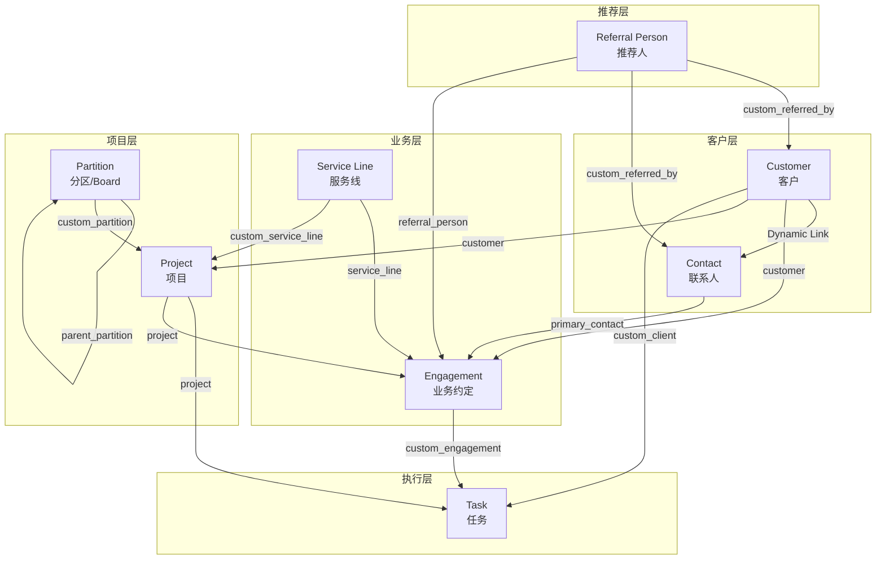
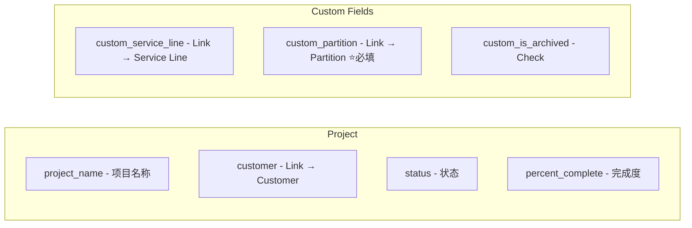
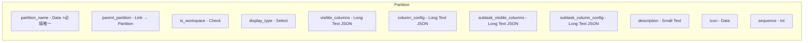
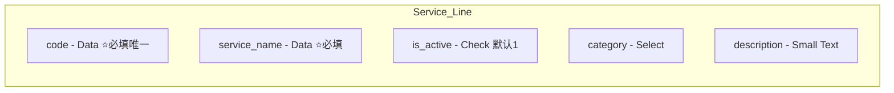
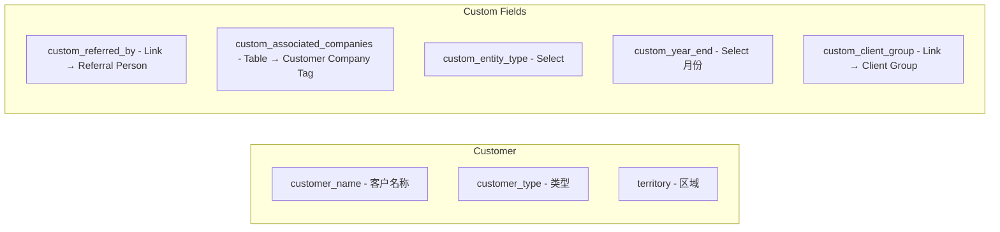
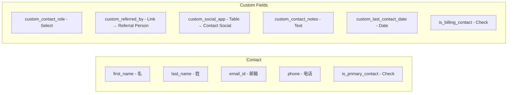
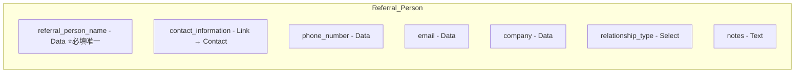

# Smart Accounting 核心数据架构

## 核心 DocType 关系图



---

## 各 DocType 详细字段

### 1. Task (任务) - ERPNext原生 + 自定义字段

```mermaid
flowchart LR
    subgraph Task
        direction TB
        T1[subject - 任务名称]
        T2[project - Link → Project]
        T3[parent_task - Link → Task]
        T4[status - 原生状态]
        T5[priority - 优先级]
        T6[description - 描述]
    end
    
    subgraph Custom Fields
        direction TB
        C1[custom_client - Link → Customer]
        C2[custom_tftg - Link → Company]
        C3[custom_service_line - Link → Service Line]
        C4[custom_engagement - Link → Engagement]
        C5[custom_task_status - Select 自定义状态]
        C6[custom_target_month - Select 月份]
        C7[custom_lodgement_due_date - Date]
        C8[custom_year_end - Select 月份]
        C9[custom_budget_planning - Currency]
        C10[custom_actual_billing - Currency]
        C11[custom_note - Long Text]
        C12[custom_frequency - Select]
        C13[custom_is_archived - Check]
        C14[custom_roles - Table → Task Role Assignment]
        C15[custom_softwares - Table → Task Software]
        C16[custom_review_notes - Table → Review Note]
        C17[custom_communication_methods - Table → Task Communication Method]
    end
```



**Task 自定义状态选项:**
- Not Started, Done, Working on it, Stuck
- Ready for Manager Review, Ready for Partner Review
- Review Points to be Actioned, Ready to Send to Client
- Sent to Client for Signature, Ready to Lodge, Lodged
- Question Book Sent, Annual GST, Wait for Payment
- Waiting on Payroll, Waiting on Client, Hold
- Not Trading, R&D, For Invoicing

---

### 2. Project (项目) - ERPNext原生 + 自定义字段



---

### 3. Engagement (业务约定) - 自定义DocType

```mermaid
flowchart LR
    subgraph Engagement
        direction TB
        E1[customer - Link → Customer ⭐必填]
        E2[company - Link → Company]
        E3[service_line - Link → Service Line]
        E4[project - Link → Project]
        E5[referral_person - Link → Referral Person]
        E6[frequency - Select]
        E7[fiscal_year - Link → Fiscal Year ⭐必填]
        E8[engagement_letter - Attach]
        E9[owner_partner - Link → User]
        E10[primary_contact - Link → Contact]
        E11[accounting_contact - Link → Contact]
        E12[tax_contact - Link → Contact]
        E13[grants_contact - Link → Contact]
    end
```



**Engagement Frequency选项:**
- Annually, Half-yearly, Quarterly, Monthly
- Fortnightly, Weekly, One-time

---

### 4. Partition (分区/Board) - 自定义DocType



**Display Type选项:**
- table, board

---

### 5. Service Line (服务线) - 自定义DocType



**Category选项:**
- Tax, BAS, Bookkeeping, Payroll, ASIC
- Advisory, Compliance, Ad-Hoc, Others

---

### 6. Customer (客户) - ERPNext原生 + 自定义字段



**Entity Type选项:**
- Company, Individual, Partnership, Trust, Other

---

### 7. Contact (联系人) - ERPNext原生 + 自定义字段



**Contact Role选项:**
- Primary, Accounting, Tax, Grants, Other

---

### 8. Referral Person (推荐人) - 自定义DocType



---

## 关系说明表

| DocType | 字段名 | 类型 | Link 到 | 说明 |
|---------|--------|------|---------|------|
| **Task** |
| | project | Link | Project | 任务所属项目 |
| | custom_client | Link | Customer | 任务所属客户 |
| | custom_engagement | Link | Engagement | 关联的业务约定 |
| | custom_service_line | Link | Service Line | 服务类型(可选) |
| | custom_tftg | Link | Company | TF/TG公司 |
| | custom_roles | Table | Task Role Assignment | 角色分配 |
| | custom_softwares | Table | Task Software | 使用软件 |
| **Project** |
| | customer | Link | Customer | 项目所属客户 |
| | custom_partition | Link | Partition | 项目所属分区 ⭐必填 |
| | custom_service_line | Link | Service Line | 项目的服务类型 |
| **Engagement** |
| | customer | Link | Customer | 约定所属客户 ⭐必填 |
| | project | Link | Project | 关联的项目 |
| | service_line | Link | Service Line | 服务类型 |
| | referral_person | Link | Referral Person | 推荐人 |
| | primary_contact | Link | Contact | 主要联系人 |
| | owner_partner | Link | User | 负责合伙人 |
| **Partition** |
| | parent_partition | Link | Partition | 父分区（层级结构） |
| **Customer** |
| | custom_referred_by | Link | Referral Person | 推荐人 |
| | custom_client_group | Link | Client Group | 客户组 |
| **Contact** |
| | custom_referred_by | Link | Referral Person | 推荐人 |
| **Referral Person** |
| | contact_information | Link | Contact | 联系信息 |

---

## 层级结构

```
Partition (Board/工作区)
    └── Project (项目/年度服务)
            ├── custom_service_line -> Service Line (标记服务类型)
            └── Task (任务/实际工作项)
                    ├── custom_client -> Customer
                    └── custom_engagement -> Engagement
```

---

## 使用场景示例

```
Service Line: "Individual Tax Return"

Project: "Individual Tax Return - FY2024"
    └── custom_service_line -> "Individual Tax Return"
    └── custom_partition -> "Top Figures"
    └── Task: Client A 的税务工作
    └── Task: Client B 的税务工作

Project: "Individual Tax Return - FY2025"
    └── custom_service_line -> "Individual Tax Return"
    └── custom_partition -> "Top Figures"
    └── Task: Client A 的税务工作
    └── Task: Client C 的税务工作
```

这样按年份分Project，但都Link到同一个Service Line，数据清晰不混乱。
